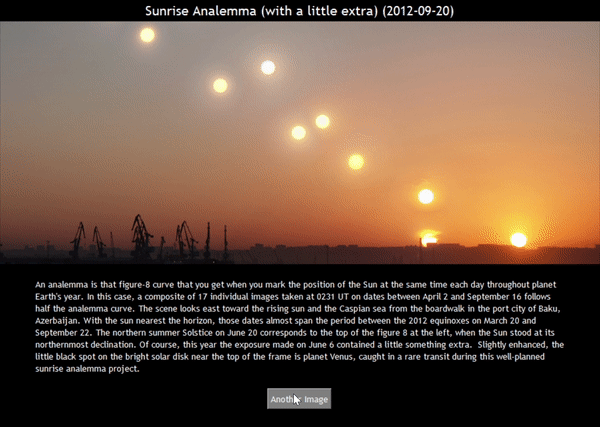

# SkySight
  

- A desktop gallery that retrieves the Astronomical Picture of the Day (APOD) -- and its decrsiptions -- of random dates from NASA's API
- Big thanks to brendnav

# Github Packages
1. Create a virtual environment (recommended)
2. Install the nasa-api python wrapper from https://github.com/brendanv/nasa-api
3. pip install pillow for image handling

# How to get NASA API Key
- Visit this page to obtain your NASA API key https://api.nasa.gov/index.html#apply-for-an-api-key
